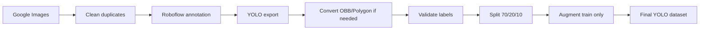

# 🇻🇳 Vietnamese License Plate Dataset YOLO


Dataset ảnh **biển số xe tại Việt Nam** được thu thập từ **Google Images**, gán nhãn thủ công bằng **Roboflow**, xử lý bằng **Python** và chuẩn hóa về định dạng **YOLO Bounding Box** cho bài toán **Object Detection**.

> ⭐ Nếu project hữu ích, hãy cho một sao nhé! ⭐

---

## 🔗 Links

| Nguồn | Link |
|---|---|
| 📦 Kaggle Dataset | [Vietnamese License Plates Dataset](https://www.kaggle.com/datasets/tanhphp/vietnamese-license-plates) |
| 🧠 Repo huấn luyện YOLOv26 | [Yolov26 License Plate Number Detection](https://github.com/franceto/Yolov26_License-plate-number_Detection) |
| 👤 Author | [franceto (ANH PHAP TO)](https://github.com/franceto) |

---

## 📌 Overview

Dataset phục vụ bài toán **phát hiện biển số xe Việt Nam** trong ảnh thực tế.

| Hạng mục | Mô tả |
|---|---|
| Bài toán | License Plate Detection |
| Quốc gia | Việt Nam |
| Class | `Bien-so` |
| Số class | 1 |
| Format | YOLO bbox |
| Annotation | Gán nhãn thủ công bằng Roboflow |
| Split | Train / Val / Test |
| Augmentation | Chỉ áp dụng trên tập train |

Dataset có nhiều dạng phương tiện và bối cảnh: xe máy, xe con, xe tải; ảnh sáng, tối, mờ, chói, che khuất một phần, nền phức tạp; biển số có thể nhỏ, nghiêng, xa camera hoặc có nhiều biển số trong một ảnh. Bounding box được gán sát vùng biển số, không gán cả xe hoặc nền xung quanh.

---

## 🖼️ Sample Bounding Boxes


---

## 📊 Dataset Statistics

### Trước tăng cường dữ liệu

| Thuộc tính | Giá trị |
|---|---:|
| Tổng ảnh gốc | 728 |
| Tổng bounding box | 964 |
| Số class | 1 |
| Tên class | `Bien-so` |
| Label format | YOLO bbox |
| Split ratio | 70 / 20 / 10 |

### Split gốc trước augmentation

| Split | Images | Labels |
|---|---:|---:|
| Train | 509 | 509 |
| Val | 146 | 146 |
| Test | 73 | 73 |

> Phiên bản hiện tại đã **augment tập train**. Tập **val/test giữ nguyên** để đánh giá khách quan và tránh data leakage.

---

## 📈 Visual Statistics

### Train / Val / Test


### Image Size Distribution


### Bounding Box Size Distribution


---

## 🔁 Pipeline



---

## 🧹 Preprocessing

| Bước | Mục tiêu |
|---|---|
| Giải nén ảnh gốc | Chuẩn hóa dữ liệu đầu vào |
| Xóa ảnh trùng lặp | Tránh lặp dữ liệu |
| Kiểm tra kích thước ảnh | Nắm phân bố dữ liệu |
| Gán nhãn Roboflow | Tạo bbox cho biển số |
| Convert OBB/Polygon → YOLO bbox | Chuẩn hóa label về 5 cột |
| Kiểm tra label | Phát hiện label rỗng, sai class, bbox lỗi |
| Split an toàn | Chia train/val/test trước augmentation |
| Augment train | Tăng độ đa dạng cho huấn luyện |
| Giữ nguyên val/test | Tránh data leakage |

---

## 🧬 Train Augmentation

| Augmentation | Mục tiêu |
|---|---|
| Brightness / Contrast | Mô phỏng thay đổi ánh sáng |
| Hue / Saturation | Mô phỏng khác biệt màu ảnh |
| Blur nhẹ | Mô phỏng ảnh mờ nhẹ |
| Scale / Translate | Mô phỏng thay đổi vị trí |
| Rotate nhỏ | Mô phỏng góc chụp lệch |

Không dùng các biến đổi dễ làm sai đặc trưng biển số: flip ngang/dọc, xoay 90°/180°, crop mạnh làm mất biển số, cutout che trực tiếp vùng biển số.

---

## 📁 Repository Structure

```text
.
├── assets/
│   ├── bbox_size_distribution.png
│   ├── image_size_distribution.png
│   ├── sample_bbox_grid.png
│   ├── split_distribution.png
│   └── yolov26_detection_result.png
│
├── dataset/
│   ├── data.yaml
│   ├── train/
│   │   ├── images/
│   │   └── labels/
│   ├── val/
│   │   ├── images/
│   │   └── labels/
│   └── test/
│       ├── images/
│       └── labels/
│
├── notebooks/
│   └── bs.ipynb
│
├── .gitignore
├── README.md
└── requirements.txt
```

---

## 🏷️ YOLO Label Format

Mỗi file `.txt` tương ứng với một ảnh:

```text
class_id x_center y_center width height
```

Ví dụ:

```text
0 0.512345 0.634211 0.214532 0.092415
```

Các tọa độ đã được chuẩn hóa về khoảng `[0, 1]`.

---

## ⚙️ data.yaml

```yaml
train: train/images
val: val/images
test: test/images

nc: 1
names: ['Bien-so']
```

---

## 🚀 Quick Start

### 1. Clone repo

```bash
git clone https://github.com/franceto/Dataset_License-plate-number.git
cd Dataset_License-plate-number
```

### 2. Cài thư viện

```bash
pip install -r requirements.txt
```

### 3. Train nhanh với YOLO

```bash
yolo detect train model=yolov8n.pt data=dataset/data.yaml imgsz=640 epochs=100 batch=16
```

### 4. Validate

```bash
yolo detect val model=runs/detect/train/weights/best.pt data=dataset/data.yaml
```

### 5. Predict ảnh mới

```bash
yolo detect predict model=runs/detect/train/weights/best.pt source=path/to/image.jpg
```

---

## 📦 Download Dataset from Kaggle

Cài Kaggle CLI:

```bash
pip install kaggle
```

Tải dataset:

```bash
kaggle datasets download -d tanhphp/vietnamese-license-plates -p ./kaggle_dataset --unzip
```

Hoặc tải trực tiếp tại:

[https://www.kaggle.com/datasets/tanhphp/vietnamese-license-plates](https://www.kaggle.com/datasets/tanhphp/vietnamese-license-plates)

---

## 🧪 Reproduce Preprocessing

Notebook xử lý dữ liệu nằm tại:

```text
notebooks/bs.ipynb
```

Notebook gồm các bước chính:

```text
1. Giải nén dữ liệu gốc
2. Xóa ảnh trùng
3. Kiểm tra kích thước ảnh
4. Giải nén YOLO export
5. Convert label nếu cần
6. Kiểm tra bbox
7. Split train/val/test
8. Kiểm tra no-leak
9. Augment train
10. Export dataset cuối
11. Tạo biểu đồ README
```

---

## 🏆 YOLOv26 Benchmark

Dataset đã được thử nghiệm với **YOLOv26** cho bài toán phát hiện biển số xe Việt Nam.

Repo huấn luyện:

[https://github.com/franceto/Yolov26_License-plate-number_Detection](https://github.com/franceto/Yolov26_License-plate-number_Detection)

| Split | Precision | Recall | mAP50 | mAP50-95 |
|---|---:|---:|---:|---:|
| Validation | 0.9673 | 0.9281 | 0.9672 | 0.6896 |
| Test | 0.9883 | 0.9006 | 0.9494 | 0.6927 |

| Metric | Value |
|---|---:|
| mAP50 | 0.967 |
| mAP50-95 | 0.693 |


---

## ✅ Final Output

Kết quả cuối cùng là một dataset YOLO đã sẵn sàng để huấn luyện:

- 1 class: `Bien-so`
- Label chuẩn YOLO bbox
- Có sẵn `train`, `val`, `test`
- Train đã được tăng cường dữ liệu
- Val/test giữ nguyên để đánh giá công bằng
- Có notebook tái tạo pipeline
- Có ảnh minh họa và biểu đồ thống kê

---

## 🔎 Search Keywords

```text
Vietnamese license plate dataset
Vietnamese license plate YOLO dataset
Vietnam license plate detection
YOLO license plate detection dataset
Biển số xe Việt Nam dataset
Dataset biển số xe Việt Nam YOLO
franceto license plate YOLO dataset
```

---

## ⚠️ Note

Dataset được xây dựng phục vụ mục đích học tập, nghiên cứu và thực hành Computer Vision.

Nếu sử dụng trong sản phẩm thương mại hoặc công bố học thuật, vui lòng kiểm tra thêm vấn đề liên quan đến bản quyền ảnh, quyền riêng tư và nguồn dữ liệu ảnh gốc.

---

## 👥 Authors

**franceto (ANH PHAP TO)**  
GitHub: [https://github.com/franceto](https://github.com/franceto)

---

## ⭐ Support

Nếu project hữu ích, hãy cho một sao nhé! ⭐

Made with ❤️ by **Franceto (ANH PHAP TO)**
