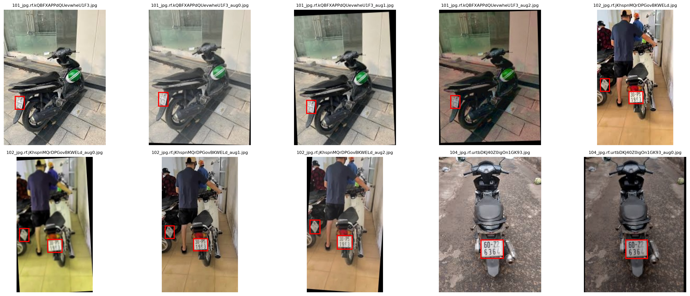
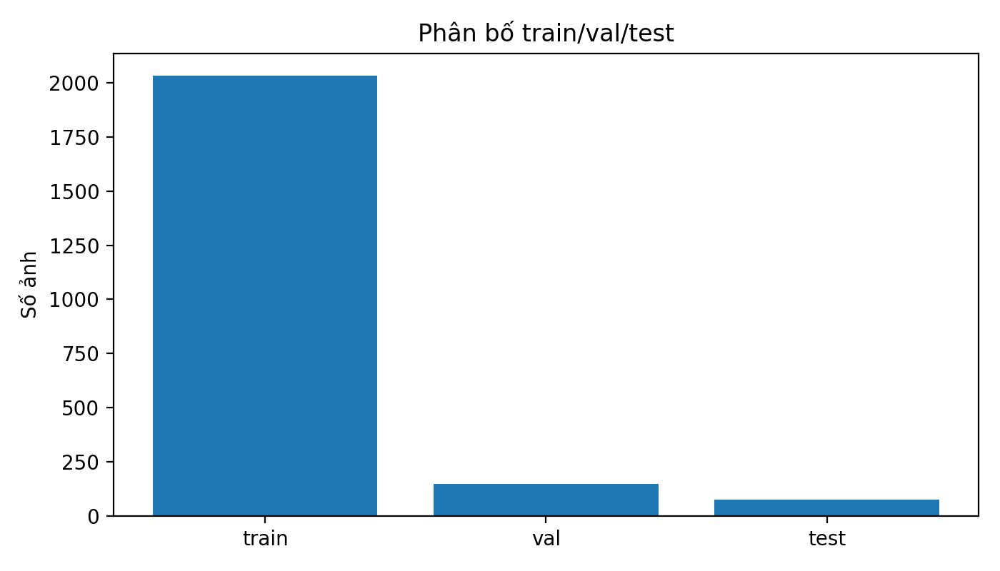
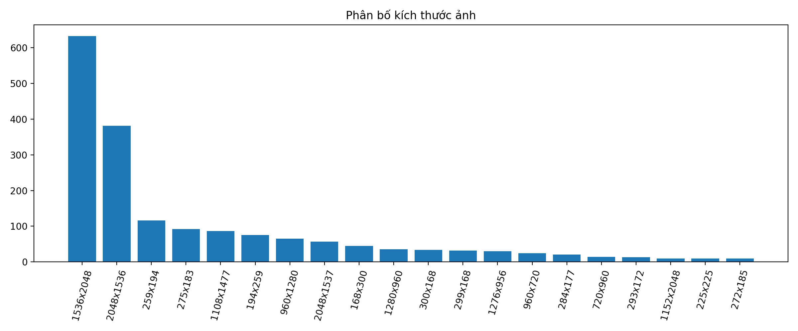
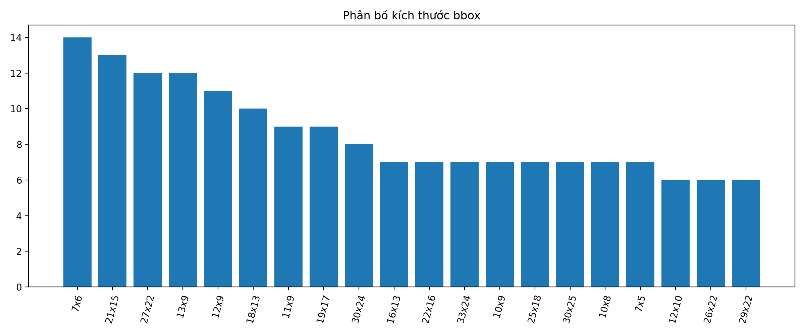
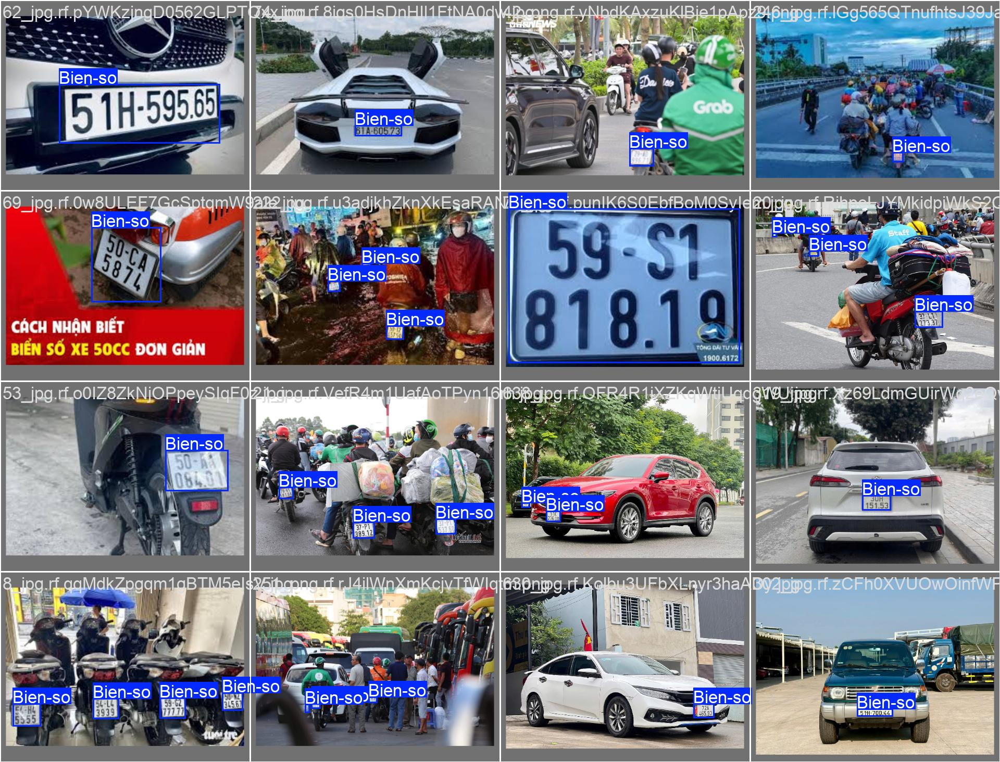

# VN Vietnamese License Plate Dataset YOLO


Dataset ảnh **biển số xe tại Việt Nam** được thu thập từ **Google Image**, gán nhãn thủ công bằng **Roboflow**, tiền xử lý bằng **Python** và chuẩn hóa về định dạng **YOLO Bounding Box** phục vụ bài toán **phát hiện biển số xe Việt Nam**.

⭐ Nếu project hữu ích, hãy cho một sao nhé! ⭐

---

## 📌 Giới thiệu dataset

Dataset này tập trung vào bài toán **phát hiện biển số xe Việt Nam** trong ảnh thực tế.

Mỗi ảnh có thể chứa một hoặc nhiều biển số xe. Bounding box được gán nhãn bám sát vùng biển số nhằm hỗ trợ huấn luyện các mô hình Object Detection như YOLOv8, YOLOv9, YOLOv11 hoặc các phiên bản YOLO tương thích.

Dataset phù hợp cho:

- Huấn luyện mô hình phát hiện biển số xe Việt Nam.
- Thực hành gán nhãn dữ liệu Object Detection.
- Xây dựng pipeline Computer Vision với YOLO.
- Làm dữ liệu thử nghiệm cho bài toán nhận diện biển số xe.

---

## 🧩 Công nghệ sử dụng

| Công nghệ | Vai trò |
|---|---|
| Google Image | Thu thập ảnh biển số xe Việt Nam |
| Roboflow | Gán nhãn bounding box và export YOLO |
| Python | Tiền xử lý, kiểm tra label, chia dữ liệu, tăng cường dữ liệu |
| Albumentations | Tăng cường dữ liệu tập train |
| Jupyter Notebook | Xây dựng pipeline xử lý dữ liệu |
| YOLO Format | Định dạng nhãn dùng cho Object Detection |

---

## 🔁 Pipeline xử lý dữ liệu

```text
Thu thập ảnh từ Google
        ↓
Lọc ảnh trùng lặp
        ↓
Gán nhãn bounding box bằng Roboflow
        ↓
Export định dạng YOLO
        ↓
Convert OBB/Polygon sang YOLO bbox nếu cần
        ↓
Kiểm tra ảnh, class, bbox
        ↓
Chia train / val / test theo tỉ lệ 70 / 20 / 10
        ↓
Chỉ tăng cường dữ liệu trên tập train
        ↓
Xuất dataset YOLO cuối cùng
```

---

## 🌍 Cách thu thập dữ liệu

Ảnh được thu thập thủ công từ Google Image với các từ khóa liên quan đến biển số xe Việt Nam.

Dataset có sự đa dạng về:

- Kích thước ảnh.
- Góc chụp.
- Khoảng cách chụp.
- Xe máy trong bối cảnh thực tế.
- Điều kiện ánh sáng khác nhau.
- Ảnh ban ngày, ban đêm, thiếu sáng, chói sáng.
- Ảnh có nền phức tạp như đường phố, sân, nhà, khu dân cư.
- Một số ảnh có biển số bị nghiêng, nhỏ, mờ hoặc bị che một phần.

Bounding box được gán sát vùng biển số, không gán cả xe hoặc vùng nền xung quanh.

---

## 📊 Thống kê dataset

### Thống kê tổng quan trước khi tăng cường dữ liệu

| Thuộc tính | Giá trị |
|---|---:|
| Tổng số ảnh gốc | 728 |
| Số class | 1 |
| Tên class | Bien-so |
| Tổng số bounding box | 964 |
| Định dạng nhãn | YOLO bbox |
| Tỉ lệ chia dữ liệu | 70 / 20 / 10 |

---

## 📁 Cấu trúc dataset

```text
dataset/
├── data.yaml
├── train/
│   ├── images/
│   └── labels/
├── val/
│   ├── images/
│   └── labels/
└── test/
    ├── images/
    └── labels/
```

---

## 🧪 Phân chia dữ liệu

Dữ liệu được chia theo tỉ lệ **70% train, 20% val, 10% test**.

| Split | Images | Labels |
|---|---:|---:|
| Train | 509 |
| Val | 146 |
| Test | 73 |

> Tập train được tăng cường dữ liệu sau khi chia. Tập val và test được giữ nguyên để tránh data leakage.

---

## 🏷️ Định dạng nhãn YOLO

Mỗi file label `.txt` có định dạng:

```text
class_id x_center y_center width height
```

Ví dụ:

```text
0 0.512345 0.634211 0.214532 0.092415
```

Trong đó:

| Thành phần | Ý nghĩa |
|---|---|
| class_id | ID class, dataset này chỉ có class 0 |
| x_center | Tọa độ tâm bbox theo trục x, đã chuẩn hóa |
| y_center | Tọa độ tâm bbox theo trục y, đã chuẩn hóa |
| width | Chiều rộng bbox, đã chuẩn hóa |
| height | Chiều cao bbox, đã chuẩn hóa |

---

## 🖼️ Ví dụ ảnh và bounding box



---

## 📈 Biểu đồ phân bố dữ liệu

### Phân bố train / val / test



### Phân bố kích thước ảnh



### Phân bố kích thước bounding box



---

## 🧹 Tiền xử lý dữ liệu

Dataset đã được xử lý qua các bước:

- Giải nén dữ liệu ảnh gốc.
- Kiểm tra và xóa ảnh trùng lặp.
- Kiểm tra kích thước ảnh.
- Kiểm tra tổng số ảnh, class và bounding box.
- Kiểm tra trực quan ảnh kèm bounding box.
- Convert label dạng polygon/OBB sang YOLO bbox 5 cột nếu cần.
- Chia dữ liệu an toàn thành train / val / test.
- Chỉ tăng cường dữ liệu trên tập train.
- Giữ nguyên val/test để đánh giá khách quan.
- Xuất dataset cuối cùng theo cấu trúc YOLO.

---

## 🧬 Tăng cường dữ liệu

Tập train được tăng cường bằng các phép biến đổi nhẹ, không phá hỏng đặc trưng biển số:

- Random Brightness / Contrast.
- Hue / Saturation nhẹ.
- Blur nhẹ.
- Scale nhẹ.
- Translate nhẹ.
- Rotate nhỏ khoảng ±5 độ.

Không sử dụng các phép biến đổi dễ làm sai đặc trưng biển số như:

- Flip ngang.
- Flip dọc.
- Xoay 90 hoặc 180 độ.
- Crop mạnh làm mất biển số.
- Cutout che trực tiếp vùng biển số.

---

## ✅ Kết quả cuối cùng

Kết quả cuối cùng là một dataset biển số xe Việt Nam ở định dạng YOLO, có thể dùng trực tiếp để huấn luyện mô hình phát hiện biển số.

Dataset cuối gồm:

- 1 class: `Bien-so`
- Label chuẩn YOLO bbox.
- Có sẵn `train`, `val`, `test`.
- Tập train đã được tăng cường dữ liệu.
- Tập val/test giữ nguyên để đánh giá công bằng.
- Có file `data.yaml` để train YOLO trực tiếp.

---

## ⚙️ File data.yaml

```yaml
train: train/images
val: val/images
test: test/images

nc: 1
names: ['Bien-so']
```

---

## 🚀 Cách sử dụng với YOLO

Cài thư viện cần thiết:

```bash
pip install -r requirements.txt
```

Train thử với YOLOv8n:

```bash
yolo detect train model=yolov8n.pt data=dataset/data.yaml imgsz=640 epochs=100 batch=16
```

Train với YOLOv8s:

```bash
yolo detect train model=yolov8s.pt data=dataset/data.yaml imgsz=640 epochs=100 batch=16
```

Validate model:

```bash
yolo detect val model=runs/detect/train/weights/best.pt data=dataset/data.yaml
```

Predict ảnh mới:

```bash
yolo detect predict model=runs/detect/train/weights/best.pt source=path/to/image.jpg
```

---

## 📦 Requirements

```text
ultralytics
opencv-python
albumentations
matplotlib
pandas
pillow
```
---
## 📦 Kaggle Dataset

Dataset đã được public trên Kaggle tại:

🔗 [Vietnamese License Plates Dataset](https://www.kaggle.com/datasets/tanhphp/vietnamese-license-plates)

Bạn có thể tải dataset trực tiếp từ Kaggle để sử dụng cho bài toán phát hiện biển số xe Việt Nam bằng YOLO.
---

## 🏆 Kết quả huấn luyện với YOLOv26

Dataset này đã được thử nghiệm huấn luyện với mô hình **YOLOv26** cho bài toán phát hiện biển số xe Việt Nam.

Repo huấn luyện mô hình:

🔗 [Yolov26 License Plate Number Detection](https://github.com/franceto/Yolov26_License-plate-number_Detection)

### Kết quả đánh giá

| Split | Precision | Recall | mAP50 | mAP50-95 |
|---|---:|---:|---:|---:|
| Validation | 0.9673 | 0.9281 | 0.9672 | 0.6896 |
| Test | 0.9883 | 0.9006 | 0.9494 | 0.6927 |

### Kết quả tổng quan

| Metric | Value |
|---|---:|
| mAP50 | 0.967 |
| mAP50-95 | 0.693 |

Kết quả cho thấy dataset có khả năng huấn luyện tốt cho bài toán phát hiện biển số xe Việt Nam, đặc biệt ở chỉ số **mAP50 = 0.967** trên tập validation. Chỉ số **mAP50-95 = 0.693** phản ánh yêu cầu khắt khe hơn về độ khớp bounding box ở nhiều ngưỡng IoU khác nhau.

### Ảnh kết quả dự đoán



## ⚠️ Lưu ý

Dataset được xây dựng phục vụ mục đích học tập, nghiên cứu và thực hành Computer Vision.

Nếu sử dụng lại dataset này trong sản phẩm thương mại hoặc công bố học thuật, vui lòng kiểm tra thêm các vấn đề liên quan đến bản quyền ảnh, quyền riêng tư và nguồn dữ liệu ảnh gốc.

---

## 👥 Authors

**franceto (ANH PHAP TO)**  
GitHub: [https://github.com/franceto](https://github.com/franceto)

---

## ⭐ Support

Nếu project hữu ích, hãy cho một sao nhé! ⭐

Made with ❤️ by **Franceto (ANH PHAP TO)**